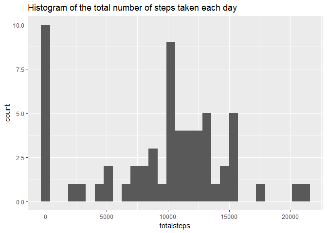
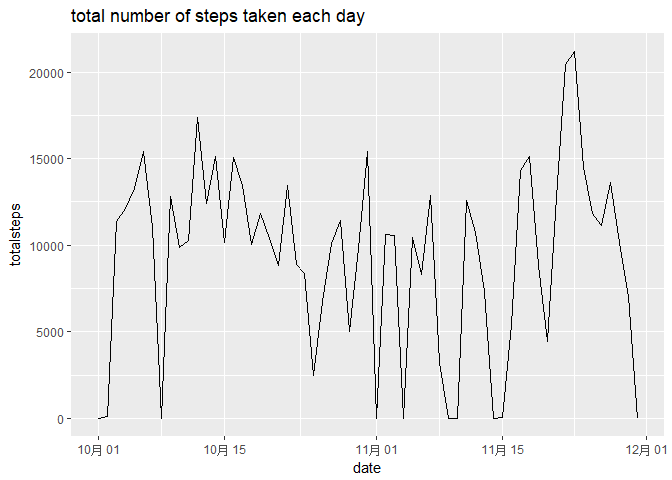
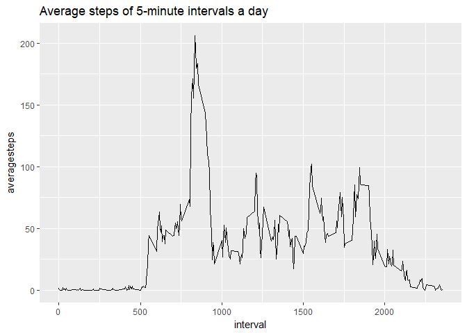
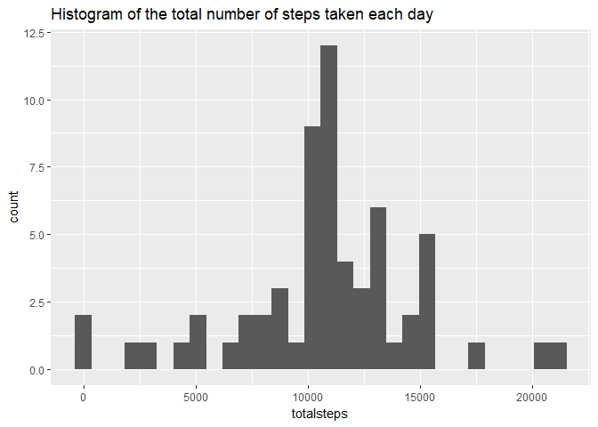
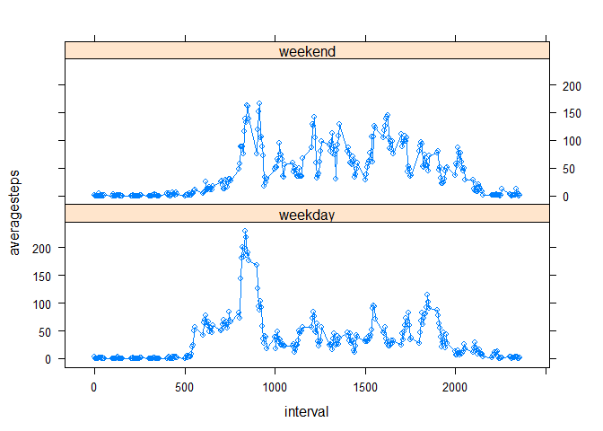

# Reproducible Research: Peer Assessment 1


## Loading and preprocessing the data
First, we need to download the data and read it into R, and we transform the date
variable into `Date` fromate


```r
library(dplyr)
```

```
## 
## Attaching package: 'dplyr'
```

```
## The following objects are masked from 'package:stats':
## 
##     filter, lag
```

```
## The following objects are masked from 'package:base':
## 
##     intersect, setdiff, setequal, union
```

```r
library(ggplot2)
url <- "https://github.com/sjm0240111/RepData_PeerAssessment1/raw/master/activity.zip"
download.file(url = url,destfile = "Factivity.zip")
unzip("Factivity.zip")
activity <- read.csv("activity.csv",header = T)
activity$date <- as.Date(activity$date,"%Y-%m-%d")
```


## What is mean total number of steps taken per day?


```r
daily <- activity %>% group_by(date) %>% summarise(totalsteps = sum(steps,na.rm=TRUE))
ggplot(daily,aes(x=totalsteps))+geom_histogram()+
    labs(title="Histogram of the total number of steps taken each day")
```

```
## `stat_bin()` using `bins = 30`. Pick better value with `binwidth`.
```

<!-- -->

```r
summary(daily$totalsteps)
```

```
##    Min. 1st Qu.  Median    Mean 3rd Qu.    Max. 
##       0    6778   10395    9354   12811   21194
```

```r
ggplot(daily, aes(x=date,y=totalsteps))+ geom_line()+
    labs(title="total number of steps taken each day")
```

<!-- -->

## What is the average daily activity pattern?


```r
peak <-activity %>% group_by(interval) %>% summarise(averagesteps = mean(steps,na.rm=T))
ggplot(peak, aes(x=interval,y=averagesteps))+geom_line()+
    labs(title="Average steps of 5-minute intervals a day")
```

<!-- -->

```r
cat("interval contains maximum number of steps: \n")
```

```
## interval contains maximum number of steps:
```

```r
peak[which.max(peak$averagesteps),1]
```

```
## # A tibble: 1 x 1
##   interval
##      <int>
## 1      835
```
It's easy to see that this person is likely to walk more in the morning, and the
peak is about 8:35.

## Imputing missing values
Here I use the mean value of the same interval to impute the missing values of steps.


```r
nas <- sum(is.na(activity$steps))
cat("number of NA: ", nas, "\nproportion of NA: ",nas/length(activity$steps))
```

```
## number of NA:  2304 
## proportion of NA:  0.1311475
```

```r
activity2 <- merge(activity,peak,by.x = "interval",by.y = "interval")
napos <- is.na(activity2$steps)
activity2$steps[napos] <- activity2$averagesteps[napos]
daily2 <- activity2 %>% group_by(date) %>% summarise(totalsteps = sum(steps,na.rm=TRUE))
ggplot(daily2,aes(x=totalsteps))+geom_histogram()+
    labs(title="Histogram of the total number of steps taken each day")
```

```
## `stat_bin()` using `bins = 30`. Pick better value with `binwidth`.
```

<!-- -->

```r
summary(daily2$totalsteps)
```

```
##    Min. 1st Qu.  Median    Mean 3rd Qu.    Max. 
##      41    9819   10766   10766   12811   21194
```
After imputing, the steps seems to have increased. This is obvious because we increaseed
the data within days.

## Are there differences in activity patterns between weekdays and weekends?
Here because my system is not English, so I choose to use 2017-7-15 and 2017-7-16
to represent weekend.

```r
wds <- as.Date(c("2017-7-15","2017-7-16"),"%Y-%m-%d")
isweekend <- weekdays(activity2$date) %in% weekdays(wds)
activity2 <- activity2 %>% mutate(weekday = factor(if_else(isweekend,"weekend","weekday")))
intervalsteps <- activity2 %>% group_by(interval,weekday) %>% summarise(averagesteps = mean(steps))
library(lattice)
xyplot(averagesteps~interval|weekday,data = intervalsteps,type="b",layout=c(1,2))
```

<!-- -->

During weekend, this person seem to walk much more in the afternoon.
